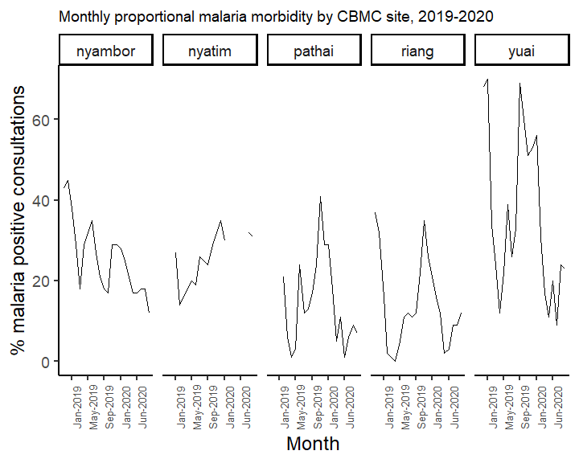
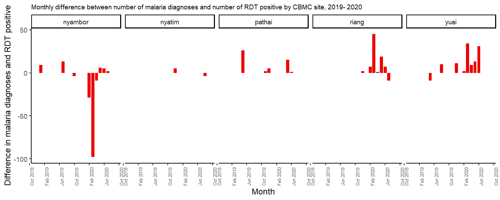
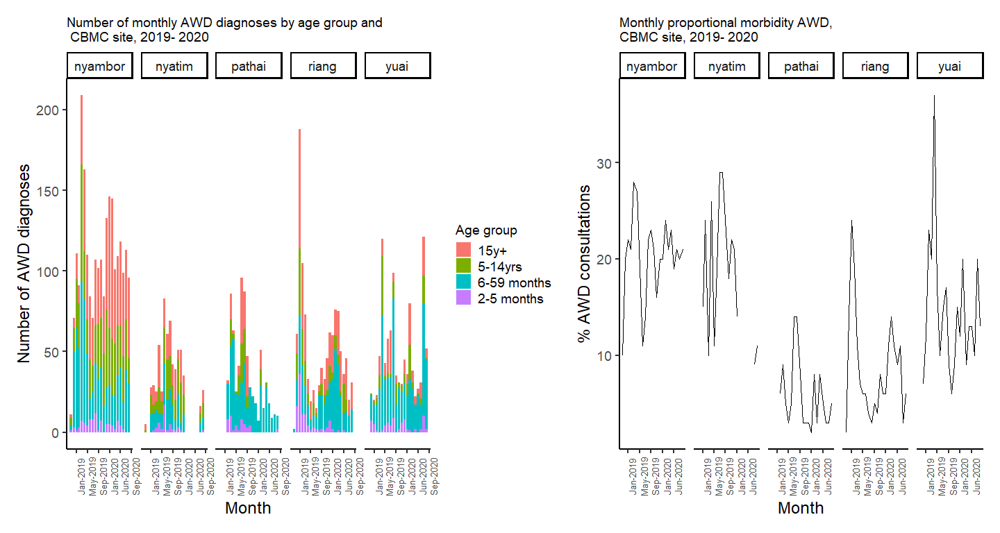
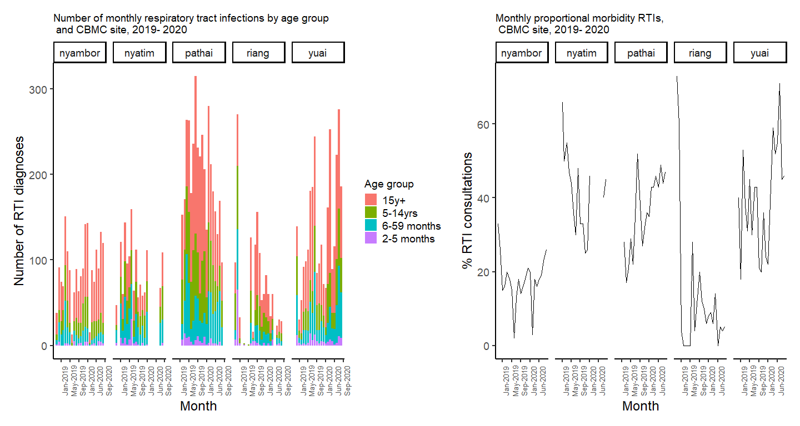
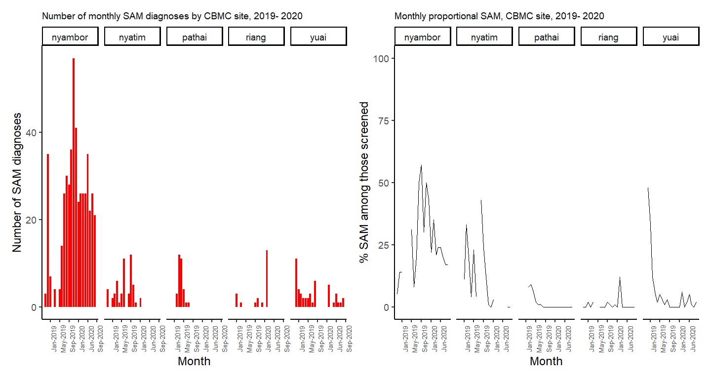
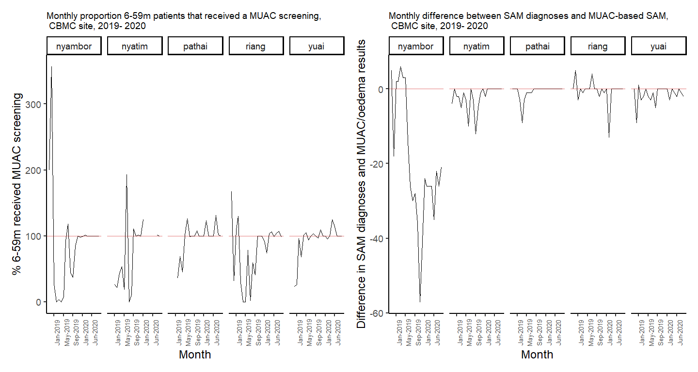

<!-- ## Installing and loading required packages  -->
<!-- ~~~~~~~~~~~~~~~~~~~~~~~~~~~~~~~~~~~~~~~~~~~~~~~~~~~~~~~~~~~~~~~~~~~~~~~~~~~
/// setup \\\
--------------------------------------------------------------------------------

Several packages are required for different aspects of  analysis with *R*. 
You will need to install these before starting. 

These packages can be quite large and may take a while to download in the
field. If you have access to a USB key with these packages, it makes sense to
copy and paste the packages into your computer's R package library 
(run the command .libPaths() to see the folder path). 

For help installing packages, please visit https://r4epis.netlify.com/welcome
~~~~~~~~~~~~~~~~~~~~~~~~~~~~~~~~~~~~~~~~~~~~~~~~~~~~~~~~~~~~~~~~~~~~~~~~~~~~ -->

<!-- ~~~~~~~~~~~~~~~~~~~~~~~~~~~~~~~~~~~~~~~~~~~~~~~~~~~~~~~~~~~~~~~~~~~~~~~~~~~
/// define_current_week \\\
--------------------------------------------------------------------------------

You need to set the week you want to report on. Generally, this is the previous
week. Put it below.

aweek::set_week_start will define the beginning of the week. The standard is
Monday.
~~~~~~~~~~~~~~~~~~~~~~~~~~~~~~~~~~~~~~~~~~~~~~~~~~~~~~~~~~~~~~~~~~~~~~~~~~~~ -->

<!-- **This section will need to be updated weekly** -->

<!-- Data as reported by 2020 W39 and the data on outbreak prone diseases comes primarily from OPD data but also CBMC sites for diseases such as malaria and AWD. -->

<!-- ## Source R function required to import MSF data from OPD tools -->

<!-- ~~~~~~~~~~~~~~~~~~~~~~~~~~~~~~~~~~~~~~~~~~~~~~~~~~~~~~~~~~~~~~~~~~~~~~~~~~~
/// read_cbmc data \\\
--------------------------------------------------------------------------------
This section is for the following datasets
CBMC data from each of the 4 sites
~~~~~~~~~~~~~~~~~~~~~~~~~~~~~~~~~~~~~~~~~~~~~~~~~~~~~~~~~~~~~~~~~~~~~~~~~~~~ -->

<!-- ## Prep for all datasets -->
<!-- - Add site variable to all -->
<!-- - combine all datasets -->
<!-- - create epiweek variable -->

<!-- ## Create necessary variables -->
<!-- - total cbmc consultations (all ages) -->
<!-- - total rdt pos (all ages) -->
<!-- - proportion of rdt pos out of all consultations -->
<!-- - proportional morbidity malaria -->
<!-- - total awd consultations -->
<!-- - proportional morbidity awd -->
<!-- - total pneumonia -->
<!-- - proportional morbidity pneumonia -->
<!-- - total SAM or oedema -->
<!-- - proportion of SAM or oedema -->

<!-- ## Make a database that can be used to calculate monthly values per site -->
<!-- - consultations numbers -->
<!-- - consultations numbers per age group -->
<!-- - proportion malaria positive -->
<!-- - number of malaria positive by age group -->
<!-- - total rdt positive -->
<!-- - total malaria diagnoses -->

<!-- ## Count all CBMC consultations per site and per month -->

<!-- ## Malaria positive counts -->
<!-- Count total malaria RDT positive consultations by age group by site -->

<!-- ## Malaria positivity rate -->

<!-- ## Discrepancy database between between malaria RDT positive and malaria diagnoses -->

<!-- ## AWD diagnoses by age  -->

<!-- ## rti diagnoses by age  -->

## Summary  
This is monthly summary of CBMC data from Lankien. This report contains data up to 2020 Sep and provides information on consultation numbers, malaria, awd, respiratory tract infections and highlights some data quality issues.

* Consultations  
In 2020 Sep there were 468, 241, 206, 538 and 408 consultations in Nyambor, Nyatim, Pathai, Riang and Yuai respectively. Clear differences in consultation patterns across the CBMC sites with Nyambor showing regular  numbers over the time period. The other sites seem to show greater or lesser effects of seasons on consultation numbers.
  

<!-- #### CBMC consultations-->
<!-- -->

* Malaria  
In 2020 Sep there were 57, 75, 15, 63 and 94 malaria positive consultations in Nyambor, Nyatim, Pathai, Riang and Yuai respectively. Much larger and clearer malaria peaks in Pathai, Riang and Yuai compared to Nyambor and Nyatim.

<!-- ## Total malaria positive consultations -->

<!-- ## Malaria positivity rate -->

<!-- #### Combine case number and positivity -->

<!-- -->

<!-- ## Proportional malaria morbidity-->

 - **Proportional malaria morbidity:** In 2020 Sep, the proportional malaria morbidity was 12, 31, 7, 12 and 23
in Nyambor, Nyatim, Pathai, Riang and Yuai respectively.

<!-- -->

 - **Data quality for malaria diagnoses**: The months where there more or fewer malaria diagnoses compared to number of RDT positive malaria cases are highlighted in red. In 2020, we see that there were 6, 1, 2, 6 and 5 months with discrepancies in the number of malaria diagnoses and number of RDT positive cases in Nyambor, Nyatim, Pathai, Riang and Yuai respectively.
  

<!-- #### discrepancies in RDT pos and malaria diagnoses -->

<!-- -->

*  AWD  
In 2020 Sep, there were 96,  26, 10, 31 and 52 AWD cases in Nyambor, Nyatim, Pathai, Riang and Yuai respectively.

<!-- ## Proportional morbidity awd cases -->

<!-- #### Combine case number and proportional morbidity awd -->

<!-- -->

* Respiratory tract infections  
In 2020 Sep, there were 120,  109, 97, 28 and 186 respiratory tract infections (uncomplicated pneumonia/cough/cold) cases in Nyambor, Nyatim, Pathai, Riang and Yuai respectively.

<!-- ## Proportional morbidity rti cases -->

<!-- #### Combine case number and proportional morbidity rti -->

<!-- -->

* Malnutrition  

In 2020 Sep, there were 21,  0, 0, 0 and 2 children aged 6-59m with severe acute  malnutrition based on MUAC or oedema in Nyambor, Nyatim, Pathai, Riang and Yuai respectively. Nyambor shows a higher stable rate of malnutrition compared to the other sites, but it could be related to the population size of the catchment area of the Nyambor CBMC.

<!-- ## Proportional sam -->

<!-- #### Combine case number and % sam -->

<!-- -->

<!-- ## Proportional children aged 6_59m who were screened -->
 - **Data quality for severe acute malnutrition**: Normally all children aged between 6-59 months should receive a MUAC screening. As can be seen below, the proportion that are screened has improved over time in all projects but the team need support in providing accurate figures as many times the proportion of children aged 6-59m screened by a MUAC exceeds the total number of children aged 6-59m consulted (red line set to 100%). Riang seems to have improved a lot whereby earlier reports showe less than ideal MUAC screening of children aged 6-59m.
 
- As can be seen in the graph showing the monthly difference between reported SAM diagnoses and the number of SAM patients based on MUAC/oedema, the team in Nyambor are consistently having problems harmonising their numbers (i.e. above or below the red line set at 0 for no difference). The other CBMC sites also have difficulty but less extreme and less often compared to Nyambor.

<!-- -->
